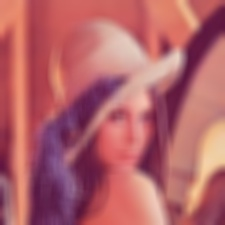

# Image-Video-Processing-OpenCV-Cpp

## 1. Objective

To demonstrate various image and video processing and applications using OpenCV with C++ API. These applications include reading and visualizing image and video files as well as live video stream, color space conversion, smoothing, denoising, thresholding, edge detection, feature detections. We also demonstrate a quick prototyping of face detection and recognition application using Haar Cascades OpenCV functionalities. 

## 1. Submitted Code

|#                 | File name         |  Description 
|------------------|-------------------|--------------------|
|1                 | /code/demo_3_1.cpp      |Implementation the visualizing, loading and saving images.  |
|1                 | /code/demo_3_2_1.cpp      |  |
|1                 | /code/demo_3_2_2.cpp      | |
|1                 | /code/demo_3_3.cpp      |  |
|1                 | /code/demo_3_4.cpp      |  |
|1                 | /code/demo_3_5.cpp      | |
|1                 | /code/demo_3_6.cpp      |  |
|1                 | /code/demo_3_7.cpp      |  |

## 2. OpenCV Installation and Visual Studio Project Setup

* The latest OpenCV version with C++ API can be downloaded from [opencv.org](https://opencv.org/releases/).

* Step by step detailed instructions of configuaring the latest download OpenCv for Windows version (OpenCV – 4.5.1) for Visual Studio 2019 Project (Microsoft Visual Studio Community 2019 Version 16.9.0) can be found: [here](https://medium.com/@subwaymatch/opencv-410-with-vs-2019-3d0bc0c81d96)

## 3. Image Processing 

In this section, we shall illustrate the output of several basic image processing OpenCV built-in functionalties. 

### 3.1 Loading, Visualizing and Saving Images

We shall use the commonly used input image of Lena, as illustrated next.

  

    
  

#### 3.2 Image Smoothing 

We explored the performnce of the following OpenCV built-in image smoothing a;lgorithms:
* Homogenous bluring
* Gaussian blurring
* Median blurring
* Box filter bluring.

<table>
  <tr>
    <td> Homogeneous Blur </td>
    <td> </td>
   </tr> 
   <tr>
    <td> Gaussian Blur </td>
    <td> </td>
  </tr>
  <tr>
    <td> Median Blur </td>
    <td> </td>
  </tr>
  <tr>
    <td> Box Filter Blur </td>
    <td> </td>
  </tr>
</table>

#### 3.3 Image Denoising

We explored the performnce of the following OpenCV built-in image denoising a;lgorithms:
* Bilateral filtering
* Non-local means filtering.

<table>
  <tr>
    <td> Noisy Image </td>
    <td> </td>
   </tr> 
   <tr>
    <td> Bilateral Filter </td>
    <td> </td>
  </tr>
  <tr>
    <td> Median Blur </td>
    <td> </td>
  </tr>
</table>

### 3.4 Image thresholding

### 3.5 Edge Detection

### 3.6 Color Space Conversion

### 3.7 Features Detection

### 3.8 Image Blending

## 4. Image Processing using Track Bar User Interface

## 5. Live Video Stream Processing

## 6. Project: Face Detection, Tracking and Recognition

## 7. Conclusion

