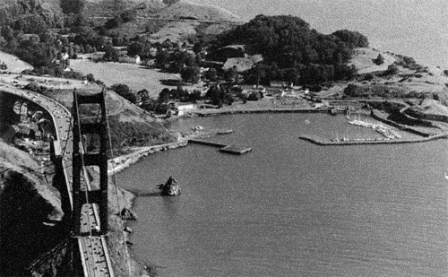
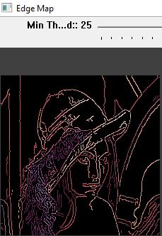

# Image-Video-Processing-OpenCV-Cpp

## 1. Objective

To demonstrate various image and video processing and applications using OpenCV with C++ API. These applications include reading and visualizing image and video files as well as live video stream, color space conversion, smoothing, denoising, thresholding, edge detection, feature detections. We also demonstrate a quick prototyping of face detection and recognition application using Haar Cascades OpenCV functionalities. 

## 1. Submitted Code

|#                 | File name         |  Description 
|------------------|-------------------|--------------------|
|1                 | /code/demo_3_1.cpp      |OpenCV-C++-API Implementation of the functionalities for the visualizing, loading and saving images.  |
|2                 | /code/demo_3_2.cpp      |OpenCV-C++-API Implementation of the functionalities for smoothing images |
|3                 | /code/demo_3_3.cpp    |OpenCV-C++-API Implementation of the functionalities for denoising images |
|4                 | /code/demo_3_4.cpp      |OpenCV-C++-API Implementation of the functionalities for thresholding images  |
|5                 | /code/demo_3_5.cpp      |OpenCV-C++-API Implementation of the functionalities for detecting edges in images  |
|6                 | /code/demo_3_6.cpp      |OpenCV-C++-API Implementation of the functionalities for converting images to different color spaces.|
|7                 | /code/demo_3_7.cpp      |OpenCV-C++-API Implementation of the functionalities for blending images  |
|8                 | /code/demo_3_8.cpp      |OpenCV-C++-API Implementation of the functionalities for detecting features from images  |
|9                 | /code/demo_3_9.cpp      |OpenCV-C++-API Implementation of the functionalities for blending two images together. |
|10                 | /code/demo_4.cpp      |OpenCV-C++-API Implementation of the functionalities for developing a track bar User Interface (UI) for image processing and user parameters selections  |
|11                 | /code/demo_5.cpp      |OpenCV-C++-API Implementation of the functionalities for live video stream processing |
|12                 | /code/demo_6.cpp      |OpenCV-C++-API Implementation of the functionalities of a Project: Face Detection, Tracking and Recognition |

## 2. OpenCV Installation and Visual Studio Project Setup

* The latest OpenCV version with C++ API can be downloaded from [opencv.org](https://opencv.org/releases/).

* Step by step detailed instructions of configuaring the latest download OpenCv for Windows version (OpenCV – 4.5.1) for Visual Studio 2019 Project (Microsoft Visual Studio Community 2019 Version 16.9.0) can be found: [here](https://medium.com/@subwaymatch/opencv-410-with-vs-2019-3d0bc0c81d96)

## 3. Image Processing 

In this section, we shall illustrate the output of several basic image processing OpenCV built-in functionalties. 

### 3.1 Loading, Visualizing and Saving Images

We shall use the commonly used input image of Lena, as illustrated next.

  

    
  

#### 3.2 Image Smoothing and Denoising 

We explored the performnce of the following OpenCV built-in image smoothing a;lgorithms:
* Homogenous bluring
* Gaussian blurring
* Median blurring
* Box filter bluring
* Bilateral filtering
* Non-local means filtering.

<table>
  <tr>
    <td> Image </td>
    <td> Filter Size</td>
    <td> Smoothed/Denoised Image</td>
   </tr> 
  <tr>
    <td> Noisy Image </td>
    <td>  </td>
    <td> </td>
   </tr> 
  <tr>
    <td> Homogeneous Blur </td>
    <td> 5x5 </td>
    <td> </td>
   </tr> 
   <tr>
    <td> Gaussian Blur </td>
     <td>7x7 </td>
    <td> </td>
  </tr>
  <tr>
    <td> Median Blur </td>
    <td> 5x5 </td>
    <td> </td>
  </tr>
  <tr>
    <td> Bilateral Filter </td>
    <td> 31x31 </td>
    <td> </td>
  </tr>
  <tr>
    <td> Non-Local Means Filter </td>
    <td> 21x21 </td>
    <td> </td>
  </tr>
</table>

### 3.4 Image thresholding

OpenCV offers the function threshold to perform thresholding operations. We can effectuate 5 types of Thresholding operations with this function, as illuatred [here](https://www.docs.opencv.org/2.4/doc/tutorials/imgproc/threshold/threshold.html?highlight=basic%20thresholding%20operations):

* Threshold binary
* Threshold binary, inverted
* Truncate
* Threshold to zero
* Threshold to Zero, inverted.

The results of the image thresholding are alearly sensitive to the type of applied threshold operation and the value of the selected threshold value. In order to experment with the different combinations of the thresholding type and value, OpenCV allow us to create TrackBar User Interface, which allows the user to select these paramaters settings and automatically generate and display the thresholding results correcting to the user selcted settings.

The figure below illustrates the results for the different thresholding operations, uwing a fixed threshold value of 100.
<table>
  <tr>
    <td> Thresholding Method </td>
    <td> Thresholding Value</td>
    <td> Thresholding Results</td>
   </tr> 
   <tr>
    <td>Threshold Binary</td>
    <td> 100</td>
    <td> </td>
  </tr>
  <tr>
    <td>Threshold Binary, Inverted</td>
    <td> 100</td>
    <td> </td>
  </tr>
  <tr>
    <td>Truncate</td>
    <td> 100</td>
    <td> </td>
  </tr>
  <tr>
    <td>Threshold to Zero</td>
    <td> 100</td>
    <td> </td>
  </tr>
  <tr>
    <td>Threshold to Zero, Inverted</td>
    <td> 100</td>
    <td> </td>
  </tr>
</table>

### 3.5 Edge Detection

The Canny Edge detector is a commonly used edge detector and aims to satisfy three main criteria:

* Low error rate: Meaning a good detection of only existent edges.
* Good localization: The distance between edge pixels detected and real edge pixels have to be minimized.
* Minimal response: Only one detector response per edge.

The Canny Edge detector has several configuration paramater, we identifed the following critical parameter in order to experement with it varying its value and observing the performance of teh edge detector for different values.

* threshold1 – first minimumpixel value threshold for the hysteresis procedure.

The figure below illustrates the Canny edge detection results for the different thresholding values.
<table>
  <tr>
    <td> Threshold Value</td>
    <td> Canny Edge Detection Results</td>
   </tr> 
   <tr>
    <td> 0</td>
    <td> </td>
  </tr>
  <tr>
    <td> 25</td>
    <td> </td>
  </tr>
  <tr>
    <td>50</td>
    <td> </td>
  </tr>
  <tr>
    <td> 100</td>
    <td> </td>
  </tr>
</table>

### 3.6 Features Detection

In computer vision, usually we need to find matching points between different frames of an environment. Why? If we know how two images relate to each other, we can use both images to extract information of them. When we say matching points we are referring, in a general sense, to characteristics in the scene that we can recognize easily. We call these characteristics features.

In this section, we shall illustrate the detection of threel image features that uniquely recognizable:

* Straight lines
* Circles
* Corners

### 3.6.1  Line Detection

Lines are important image features and the need for their detection rises in several applications. The figure below illustrates the result of the line deiection using Hough Transform function built-in OpenCV.

  

    
  

### 3.6.2  Circle Detection

Circles are also important image features and the need for their detection rises in several applications. The figure below illustrates the result of the circle deiection using Hough Transform function built-in OpenCV.

  

    
  

### 3.6.3  Corner Detection

Corners can be detected using the Harris corner detector in OpenCV. We created a Bar Tracker to allow us to filter out the corner detection results based on thier magniture. Only detection vectors with magnitures larger the user selected threshold are display. The figure below illustrates sample results with different user selected threshold values.

<table>
  <tr>
    <td> Threshold Value</td>
    <td> Corner Detection Results</td>
   </tr> 
   <tr>
    <td> 150</td>
    <td> </td>
  </tr>
  <tr>
    <td> 200</td>
    <td> </td>
  </tr>
</table>

### 3.7 Color Space Conversion

In many applications, the RGB color space may not be suitable and a color conversion will have to be applied to transform an RGB image to another color space. Next, we demonstrate the following commonly encountered color conversions oprations:

* RGB to GRAY
* RGB to HSV
* RGB to CIELAB
* RGB to YrCB.

<table>
  <tr>
    <td> Color SPace</td>
    <td> Image</td>
   </tr> 
   <tr>
    <td> RGB</td>
    <td> </td>
  </tr>
  <tr>
    <td> GRAY</td>
    <td> </td>
  </tr>
  <tr>
    <td> HSV</td>
    <td> </td>
  </tr>
  <tr>
    <td> CIELAB</td>
    <td> </td>
  </tr>
   <tr>
    <td> YCrCb</td>
    <td> </td>
  </tr>
</table>

## 4. Live Video Stream Processing

OpenCV also allows for live video capturing and processing from a connected camera, such as the computer camera. Omce a frame is captured, it can be processing individually as an image using tupical image processing operations, as illustrated next.

<table>
   <tr>
    <td> Captured Frame</td>
    <td> </td>
  </tr>
  <tr>
    <td> After GRAYSCALE converion</td>
    <td> </td>
  </tr>
  <tr>
    <td> After Gaussian Blurring</td>
    <td> </td>
  </tr>
  <tr>
    <td> After Canny Edge Detection</td>
    <td> </td>
  </tr>
</table>

## 5. Project: Face Detection, Tracking and Recognition

In this section, we will demonstrate the use of Haar cascade face detector implmented in OpenCV to detect and track faces from live stream video stream, Thhe results are illustrated in the figure below.

<table>
   <tr>
    <td> Captured Frame</td>
    <td> Face Detection results  ></td>
  </tr>
  <tr>
    <td> 10</td>
    <td> </td>
  </tr>
  <tr>
    <td> 100</td>
    <td> </td>
  </tr>
</table>

## 6. Conclusion

